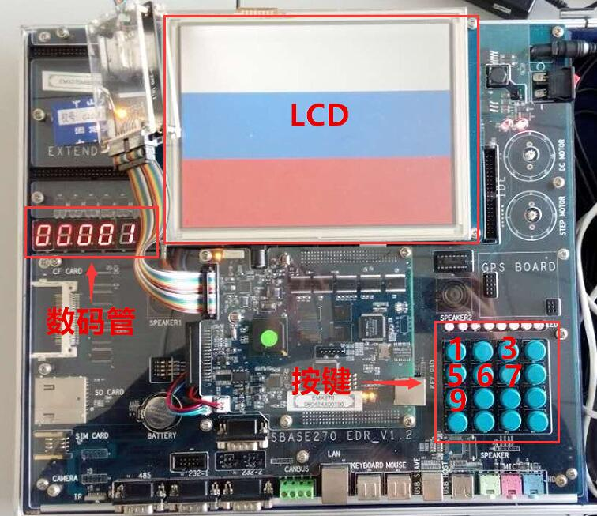

# EAlbum
An Electronic Album running on PXA270
SYSU 2015 EMBEDED SYSTEMS FINAL PROJECT

## 相关文档
所有相关的文档都包含在Manuals文件夹中，主要有

* 2015年《嵌入式系统结构与设计》期末project 设计要求——介绍了此项目的设计要求
* Intel PXA27x Processor Family Developer's Manual——介绍了PXA270寄存器的结构
* 基础实验文档——介绍了PXA270的基础模块的使用
* 设计报告——详尽地介绍了本项目实现的具体思路以及实现细节
* 经验总结报告——介绍了本项目开发过程中遇到的难题，解决方案以及经验分享
* 测试报告——介绍了本项目的测试结果
* 展示——本项目的展示PPT

## 项目介绍
本项目是基于PXA270的开发板实现的一个电子相册，但由于项目的扩展功能，使得本项目可以用于“限时猜国旗”游戏。以下是基本操作的介绍。    

* 开机时，数码管显示时间
* 按键1，显示当前日期
* 按键3，成功显示文字，再次按下关闭文字显示
* 按键5，LCD显示上一张图片
* 按键6，LCD显示下一张图片
* 按键7，启动图片轮播，LCD上的照片进行循环播放，再次按下即停止轮播
* 按键9，重置时间，日期以及图片

更多详尽内容，请参考Manuals中的*设计报告*。

